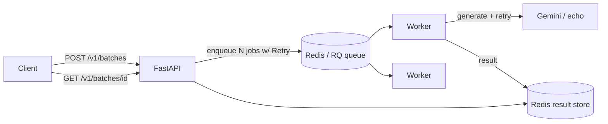

# Async LLM Batch Queue

Submit a batch of prompts over a **versioned REST API**; a pool of **Redis + RQ**
workers processes them asynchronously with **retries, exponential backoff, and
dead-lettering**, emitting **OpenTelemetry** traces. Poll for status and results.

Runs free on a Mac — the default `echo` backend needs no LLM key, and tests run
against an in-memory Redis with no server.

## Why this exists

Shows the async-infrastructure side of AI engineering: queueing, worker pools,
retry/DLQ semantics, API versioning, observability, and containerized scale-out.

| Capability | Where |
|---|---|
| Async processing + worker pool | RQ workers, `docker compose --scale worker=N` (`app/worker.py`) |
| Retries + backoff + dead-letter | `rq.Retry` + tenacity; failed registry (`app/main.py`, `app/jobs.py`) |
| API versioning | `/v1` routes + `X-API-Version` header (`app/main.py`) |
| LLM integration | Gemini backend, offline `echo` backend (`app/llm.py`) |
| Distributed tracing | OpenTelemetry spans, console/OTLP exporter (`app/tracing.py`) |
| Result store | Redis hash per batch (`app/store.py`) |
| Containerization | `Dockerfile`, `docker-compose.yml` (api + worker + redis) |
| Tests + CI | offline suite (fake Redis, inline exec), GitHub Actions |

## Architecture



## Quickstart (offline, no key)

```bash
python -m venv .venv && source .venv/bin/activate
pip install -r requirements-dev.txt
pytest                       # fake Redis, inline execution, echo LLM
```

Run the real stack:

```bash
cp .env.example .env         # optional: LLM_BACKEND=gemini + GOOGLE_API_KEY for real completions
docker compose up --build --scale worker=3
```

## Demo

```bash
BATCH=$(curl -s -X POST localhost:8000/v1/batches \
  -H 'Content-Type: application/json' \
  -d '{"prompts":["Summarize: the mitochondria","Translate hello to French"]}' \
  | python -c 'import sys,json;print(json.load(sys.stdin)["batch_id"])')

curl -s localhost:8000/v1/batches/$BATCH | python -m json.tool
```

Docs at `http://localhost:8000/docs`.

## Tech

Python · FastAPI · Pydantic · Redis · RQ · tenacity · OpenTelemetry · Gemini · Docker · GitHub Actions
